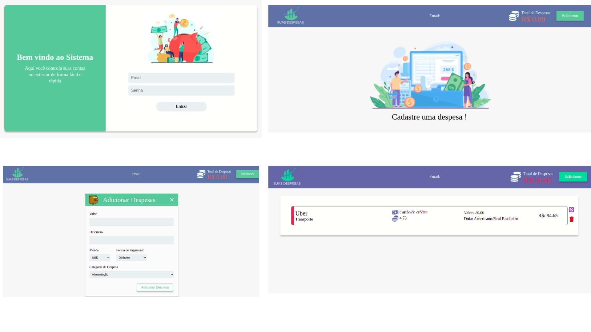
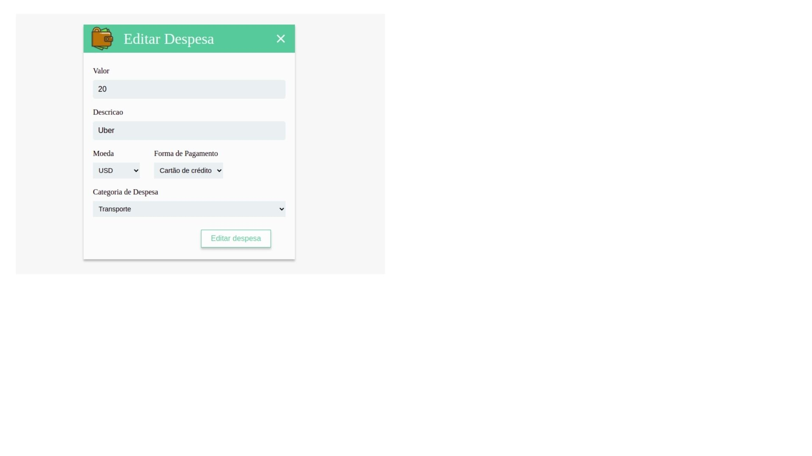

<h1 align="center">
     <a href="#" alt="site de despesa"> Suas Despesas </a>
</h1>

<h3 align="center">
    Seu sistema de controle financeiro para quem mora em outro país mas recebe em reais. 💚
</h3>

<h4 align="center">
	🚧   Concluído 🚀 🚧
</h4>

Tabela de conteúdos
=================
<!--ts-->
   * [Sobre o projeto](#-sobre-o-projeto)
   * [Funcionalidades](#-funcionalidades)
   * [Layout](#-layout)
   * [Tecnologias](#-tecnologias)

<!--te-->

## 💻 Sobre o projeto

Suas Despesas - E se você morasse no exterior gastando em uma moeda extrangeira mas ganhando em reais ? (kk vixe) Conheça o Suas despesas, um sistema para controle de despesas que utiliza a cotação de diversas moedas em tempo real. 

---

## ⚙️ Funcionalidades

- [x] Cadastro de despesas
- [x] Edição de despesas
- [x] Excluir despesas 
- [x] Visualização de despesas
- [x] Chamada de API com cotações das moedas em tempo real

---

## 🎨 Layout

  
  

## 🛠 Tecnologias

As seguintes ferramentas foram usadas na construção do projeto:

-   **React Router Dom**
-   **React**
-   **Redux**
-   **Figma**

